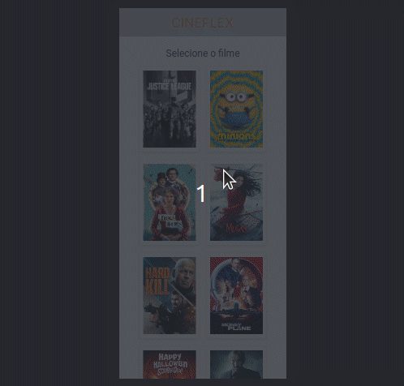

# CineFlex

See the list of available movies and choose a session to reserve your seats.



Try it out now at https://cineflex-bice.vercel.app/

## About

This is an web application with which lots of people can choose a movie and the session that best fits their schedule. Below are the implemented features:

- List all movies
- List movies sessions
- List session seats
- Reserve Seats

## Technologies

<p>
    
    
    
    
</p>

## How to run

1. Clone this repository
2. Install dependencies
```bash
npm i
```
3. Run the front-end with
```bash
npm start
```
4. You can optionally build the project running
```bash
npm run build
```
5. Finally access http://localhost:3000 on your favorite browser. 